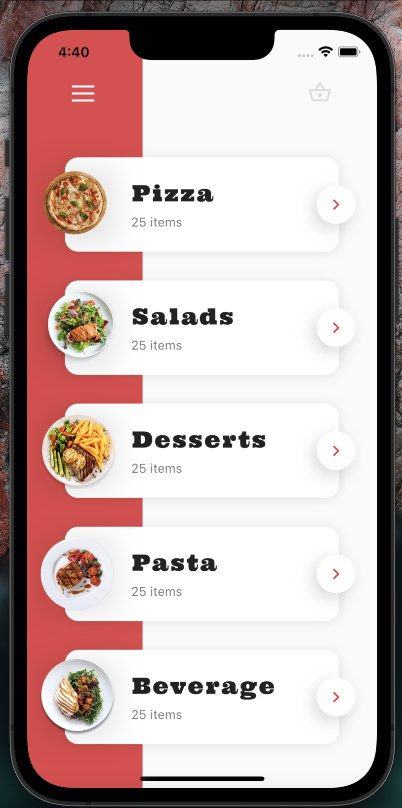
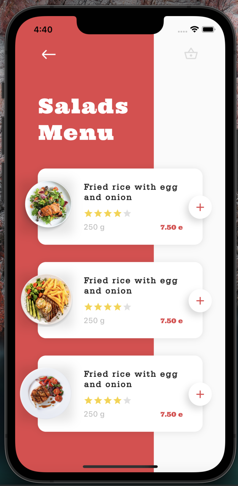
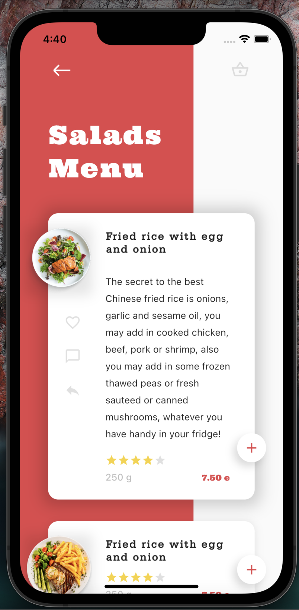
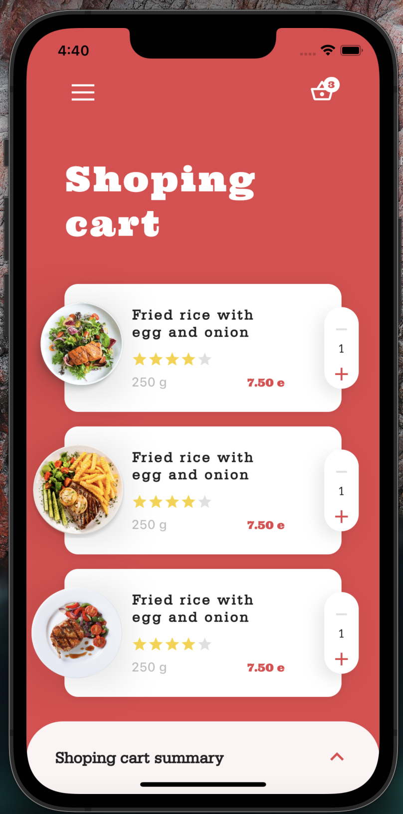
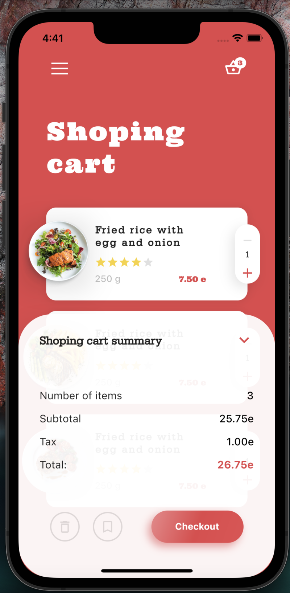

# FoodApp

FoodApp is an animated application with no external packages.

## instructions

In the terminal type the following sentence and press enter
### `flutter pub get`

## Run the application

Select an active device and run the application with any sentence below

### `F5`

### `Flutter run`

## application images

   
   
   

   
   
   

   
   

